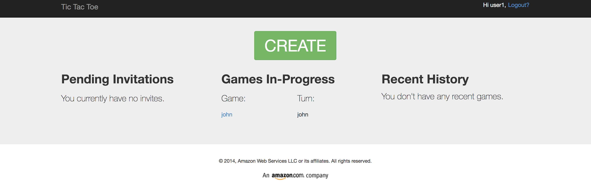
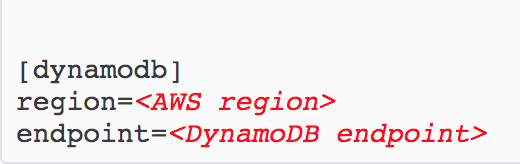
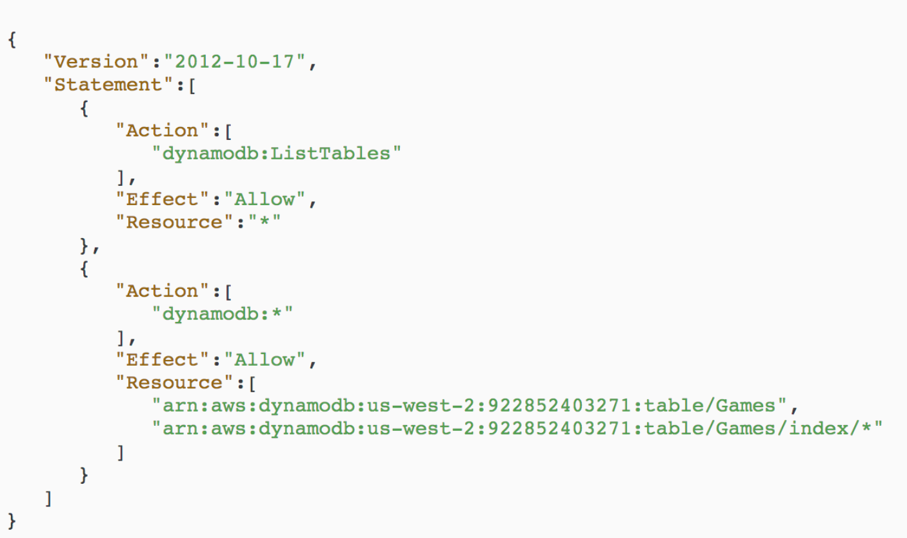
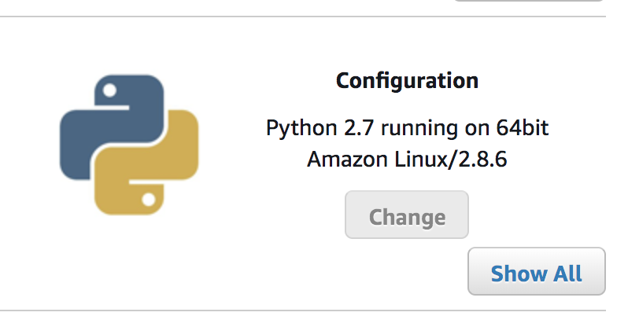
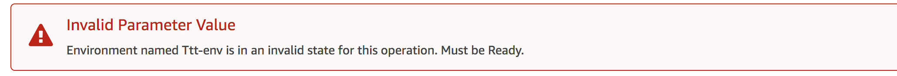

# Tic-Tac-Toe
Full Cloud Deployment Pipeline of Tic Tac Toe

## Deployed Website
- Tictactoe-env-1.uhm9bx8bpp.us-west-2.elasticbeanstalk.com

## Instructions
### Download the Required Packages
1. Install Python (https://www.python.org/downloads/) preferably 2.7
2. Install Flask and AWS SDK for Python (Boto) using the Python Package Installer (PIP)
    - PIP can installed (9https://pip.readthedocs.io/en/stable/installing/) 
        - when installing PIP make sure you are working as an administrator (sudo)
    - In the terminal type```python.exe get-pip.py```
    - Install Flask and Boto ```pip install Flask```
                             ```pip install boto```
                             ```pip install configparser ```
3. Set up a local DynamoDB (https://docs.aws.amazon.com/amazondynamodb/latest/developerguide/DynamoDBLocal.html)
4. Go to the desired location in the terminal and clone the tic-tac-toe application repository. In the terminal type:
 ```git clone https://github.com/awslabs/dynamodb-tictactoe-example-app.git```   

### Testing the Game Application Locally
1. Start DyanamoDB locally
    - To start DynamoDB on your computer navigate to the jar file location and run ```java -Djava.library.path=./DynamoDBLocal_lib -jar DynamoDBLocal.jar -sharedDb``` from your terminal
2. In your terminal type ```python application.py --mode local --serverPort 5000 --port 8000 ```
    - got to localhost:5000 in your browser
3. Now the application should be running.  



### Deployment 
1. Ensure that you have an IAM role with the necessary permissions (DynamoDBFullAccess)
2. The application will automatically create a Games table in DynamoDB.
3. Create a configuration file (text) in the root folder of the application called ```beanstalk.config```
4. In the configuration file add the following fields with your specific region and endpoint.

5. When you are creating the .zip file make sure you select all of the files in the directory and then compress them to the .zip file
6. For you IAM user/role create a new policy with your specific region and account number

7. The elastic beanstalk configuration and inside security make sure the service role
is the elastic beanstalk ec2 role and the IAM instance profile is the one with the policy attached

### CI/CD
1. In the .ebextensions add the following line designating the WSIGpath`````“aws:elasticbeanstalk:container:python”:
      WSGIPath: application.py`````


### Potential Blockers
- The version of python that is being used needs to be specified when creating the environment. 
This is found under the additional configuration options. 

- Make sure the region and DynamoDB endpoints are also in the config file that comes with the 
app repository.
- Add ID and Secret_Key to environment variables
- 